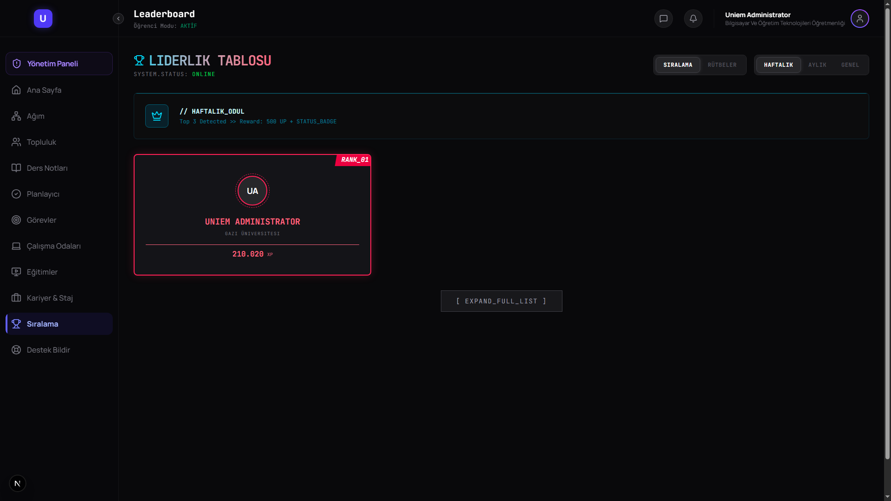

# Hi there, I'm jxpyter 👋

### 👨‍💻 SaaS Engineer | Database Administrator

Welcome to my profile! I'm a passionate developer focused on building scalable web applications and secure software solutions. Here are some of my featured works.

---

## 🚀 Private Projects Showcase

Since some of my best work is in private repositories, I've curated this showcase to demonstrate the architecture, design, and features of these projects.

### 🛡️ Ottric - Software Supply Chain Security Platform

> **Ottric** is an automated platform for managing **Software Bill of Materials (SBOM)** and **Vulnerability Exploitability Exchange (VEX)**. It helps organizations track vulnerabilities in their software supply chain, correlate them with specific releases, and provide cryptographic proof of "Not Affected" status.

| Feature | Description |
| :--- | :--- |
| 🛡️ **Automated SBOM Ingestion** | Parse and store CycloneDX/SPDX files per release. |
| 🧬 **Release Lineage** | Track **Commit -> Build -> Artifact** to know exactly which version is deployed. |
| 🔍 **Vulnerability Correlation** | Automatically detect CVEs using the **OSV.dev** database. |
| 📝 **VEX Workflow** | Manage vulnerability status (Affected, Not Affected, Fixed) with mandatory justification. |
| 🔐 **Secure by Default** | API Versioning, Rate Limiting, and Security Headers enabled out-of-the-box. |

**🛠 Tech Stack**
    

---

### 🎓 Uniem v2.0 - The Comprehensive Social Learning Platform

> **Uniem** is a next-generation education platform that combines **LMS features** with **social networking** and **gamification**. It encourages students to study together, track their progress, and earn rewards.

#### 🌟 Key Features
*   **🎮 Gamification Engine:** XP/UP system, Levels, Leaderboards, and Rewards to keep students engaged.
*   **📚 Interactive Learning:** Video courses with dynamic completion tracking and quizzes.
*   **🤝 Social Study:** Real-time **"Study Rooms"** for collaborative focus sessions using Socket.io.
*   **📅 Smart Planner:** Integrated calendar and task management tailored for students.
*   **🎟️ Tier System:** Membership levels (Starter, Plus, Premium) with dynamic access control.

**🛠 Tech Stack**
    

#### 📸 Gallery
<!-- 
  NOTE: Since this README is in the same folder as your images, we use relative paths like ./Hero.png 
  If you move these images to an 'assets' folder, update paths to ./assets/Hero.png 
-->

|  |  |
| :---: | :---: |
| **Dashboard & Hero** | **Social Study Rooms** |

|  |  |
| :---: | :---: |
| **Gamification** | **Subscription Tiers** |

---

## 🔧 Operational Tech Stack

   

---

  Generated with ❤️ by jxpyter

